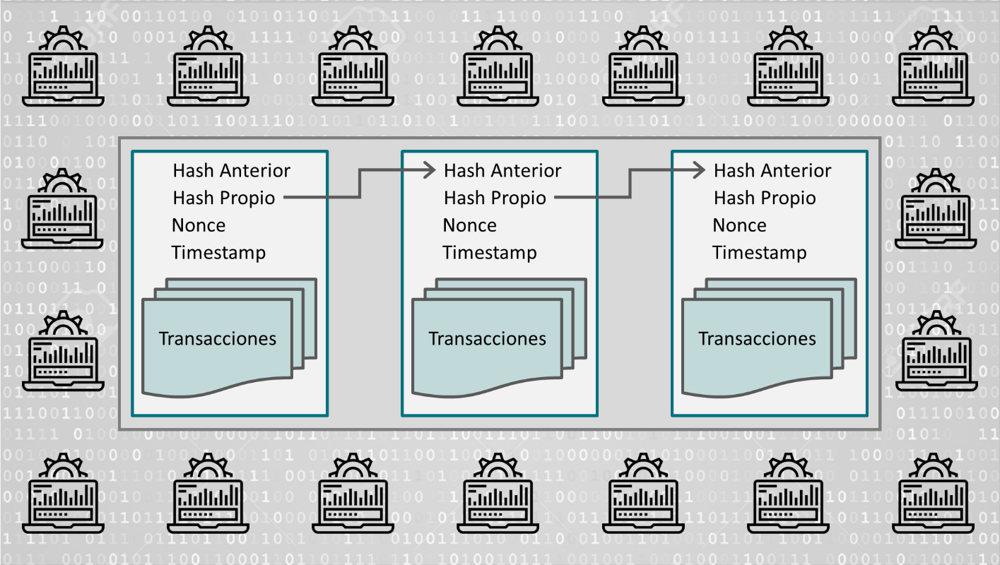

# BlockChain.go

Esta es una implementación de una blockchain en go, puedes encontrar la fuente original *[aquí](https://www.youtube.com/playlist?list=PLpP5MQvVi4PGmNYGEsShrlvuE2B33xV1L)* .

## ¿Que es un blockchain?

Una **BlockChain** es un estructura de datos en conjuntos (lo que serian los bloques) a los que se les añade metainformaciones relativas a otro bloque, por lo general relativa al bloque anterior. De esta forma, gracias a técnicas criptográficas (sha256), la información contenida en un bloque solo puede ser repudiada o editada modificando todos los bloques posteriores a este. Esta propiedad permite su aplicación en un entorno distribuido de manera que la estructura de datos **blockchain** puede ejercer de base de datos pública no relacional que contenga un histórico irrefutable de información .

Cada bloque almacena:

- una cantidad de registros o transacciones validas.
- información referente al bloque
- su vinculación con el bloque anterior y el que sigue a través de **hash** de cada bloque (un código único que sería como la huella digital del bloque)

Por lo tanto, **cada bloque tiene un lugar específico e inamovible dentro de la cadena**, ya que cada bloque contiene informacion del hash del bloque anterior. La cadena completa se guarda en cada nodo de la red que conforma la blockchain, por lo que **se almacena una copia exacta de la cadena en todos los participantes de la red**.

A medida que se crean nuevos registros, estos son primeramente verificados y validados por los nodos de la red y luego añadidos a un nuevo bloque que se enlaza a la cadena.

## ¿Por qué blockchain es tan segura?

Al ser una tecnología distribuida, donde **cada nodo de la red almacena una copia exacta de la cadena, se garantiza la disponibilidad de la información en todo momento.** En caso de que un atacante quisiera provocar una denegación de servicio, debería anular todos los nodos de la red, ya que basta con que al menos uno esté operativo para que la información esté disponible.

Por otro lado, al ser un registro consensuado, donde todos los nodos contienen la misma información, resulta casi imposible alterar la misma, asegurando su integridad. Si un atacante quisiera modificar la información en la cadena de bloques, debería modificar la cadena completa en al menos el 51% de los nodos.

Por último, dado que cada bloque está matemáticamente vinculado al bloque siguiente, una vez que se añade uno nuevo a la cadena, el mismo se vuelve inalterable. Si un bloque se modifica su relación con la cadena se rompe. Es decir, que toda la información registrada en los bloques es inmutable y perpetua.

De esta forma la tecnología de blockchain nos permite almacenar información que jamás se podrá perder, modificar o eliminar.

Además, cada nodo de la red utiliza certificados y firmas digitales para verificar la información y validar las transacciones y los datos almacenados en la blockchain, lo que permite asegurar la autenticidad de dicha información.

De esta forma, podemos pensar en blockchain como un escribano. Un medio para certificar y validar cualquier tipo de información. Un registro confiable, descentralizado, resistente a la manipulación de datos, y donde queda todo registrado.

En la actualidad estamos acostumbrados a los modelos centralizados. Le damos toda nuestra información a empresas como Google o Facebook para que la administren, mandamos todos nuestros mensajes a través de los servidores de Telegram o WhatsApp para que se ocupen de enviarlos o gastamos fortunas en escribanos e instituciones para que certifiquen y guarden nuestras escrituras o documentos importantes.

En blockchain los datos están distribuidos en todos los nodos de la red. Al no haber un nodo central, todos participan por igual, almacenando y validando toda la información. Se trata de una herramienta muy potente para comunicarnos y almacenar información de forma confiable; un modelo descentralizado donde la información es nuestra, ya que no dependemos de una compañía que brinde el servicio.

Las blockchain en la practica han sido usadas como un registro contable distribuido que permite soportar y garantizar la seguridad de **dinero digital (Bitcoin)** .

## Sistema de prueba de trabajo (proof of work)

Un algoritmo de prueba de trabajo, sistema de prueba de trabajo o simplemente **PoW** (proof of work) es un sistema creado con el fin de desincentivar y dificultar comportamientos maliciosos en la red como ataques DDoS o spam , requiere que el cliente del servicio realice algún tipo de trabajo que tenga cierto coste y que es verificado fácilmente en la parte del servidor. Normalmente el trabajo consiste en realizar un cómputo en el ordenador del cliente .

- implementación de [proof of work](https://github.com/Dieg0Code/Blockchain.go/blob/main/blockchain/proof.go) .

La característica clave de la estrategia es su asimetría: El trabajo debe ser moderadamente difícil (pero factible) por el lado del cliente, pero fácil de verificar por el lado del servidor .

### BadgerDB

Este proyecto utiliza BadgerDB v1.5.4 como base de datos para la blockchain .

- BadgerDB : Es una base de datos de tipo key - value escrita en Go puedes encontrar la documentacion [aqui](https://pkg.go.dev/github.com/dgraph-io/badger@v1.5.4?utm_source=gopls) .