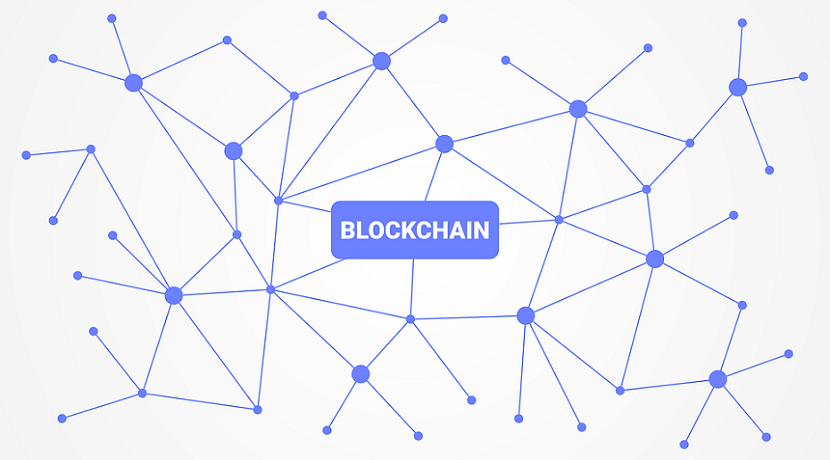

# BlockChain.go

Esta es una implementación de una blockchain en go, puedes encontrar la fuente original *[aquí](https://www.youtube.com/playlist?list=PLpP5MQvVi4PGmNYGEsShrlvuE2B33xV1L)* .

## ¿Que es un blockchain?

Una **BlockChain** es un estructura de datos en conjuntos (lo que serian los bloques) a los que se les añade metainformaciones relativas a otro bloque, por lo general relativa al bloque anterior. De esta forma, gracias a técnicas criptográficas (sha256), la información contenida en un bloque solo puede ser repudiada o editada modificando todos los bloques posteriores a este. Esta propiedad permite su aplicación en un entorno distribuido de manera que la estructura de datos **blockchain** puede ejercer de base de datos pública no relacional que contenga un histórico irrefutable de información .

Las blockchain en la practica han sido usadas como un registro contable distribuido que permite soportar y garantizar la seguridad de **dinero digital (Bitcoin)** .

## Sistema de prueba de trabajo (proof of work)

Un algoritmo de prueba de trabajo, sistema de prueba de trabajo o simplemente **PoW** (proof of work) es un sistema creado con el fin de desincentivar y dificultar comportamientos maliciosos en la red como ataques DDoS o spam , requiere que el cliente del servicio realice algún tipo de trabajo que tenga cierto coste y que es verificado fácilmente en la parte del servidor. Normalmente el trabajo consiste en realizar un cómputo en el ordenador del cliente .

- implementación de [proof of work](https://github.com/Dieg0Code/Blockchain.go/blob/main/blockchain/proof.go) .

La característica clave de la estrategia es su asimetría: El trabajo debe ser moderadamente difícil (pero factible) por el lado del cliente, pero fácil de verificar por el lado del servidor .

### BadgerDB

Este proyecto utiliza BadgerDB v1.5.4 como base de datos para la blockchain .

- BadgerDB : Es una base de datos de tipo key - value escrita en Go puedes encontrar la documentacion [aqui](https://pkg.go.dev/github.com/dgraph-io/badger@v1.5.4?utm_source=gopls) .